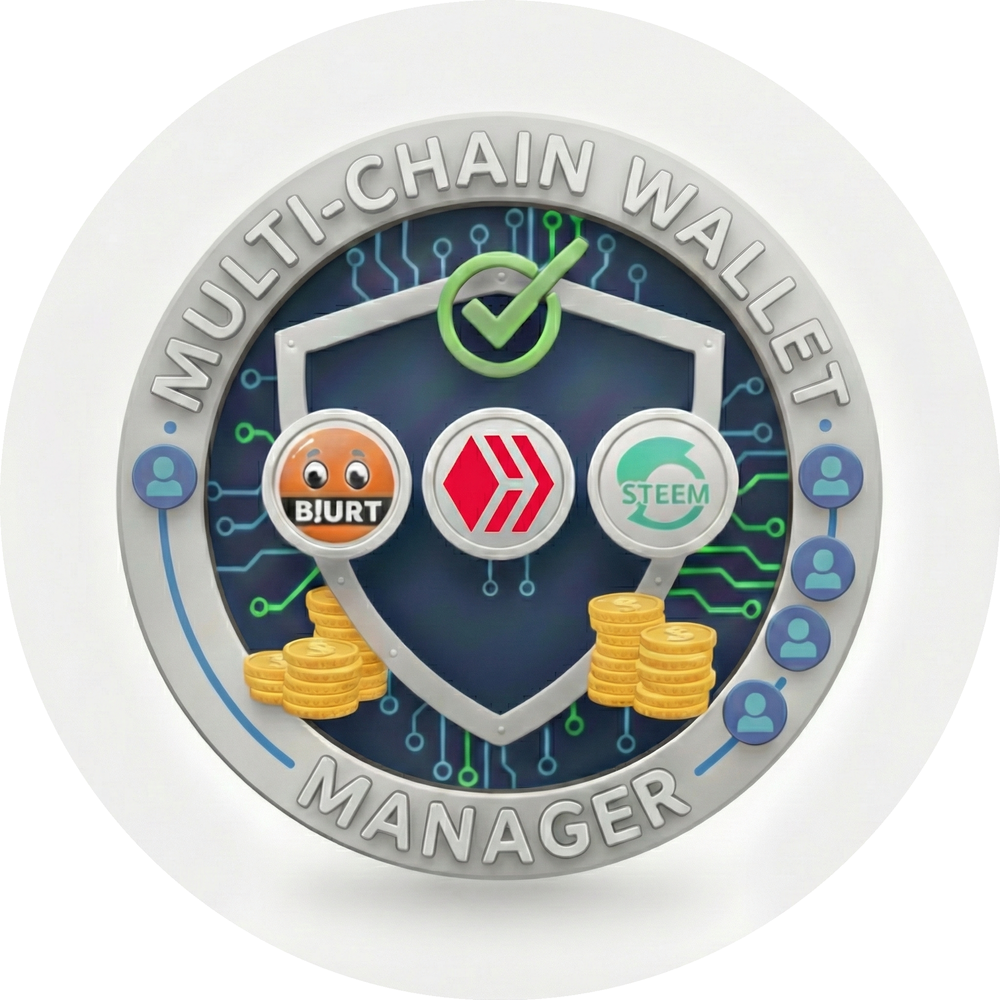

# Gravity Web3 Multi-Chain Wallet

Gravity is a secure, non-custodial browser extension wallet for the **Blurt**, **Hive**, and **Steem** blockchains. It allows you to manage accounts, transfer funds, sign transactions, and interact with Web3 dApps seamlessly.

<div align="center">

[](https://github.com/drakernoise/w3-multi-chain-wallet-manager/releases)
[](LICENSE)
[](SECURITY.md)
[](https://github.com/drakernoise/w3-multi-chain-wallet-manager/security/dependabot)
[](https://github.com/drakernoise/w3-multi-chain-wallet-manager/security/code-scanning)
[](docs/SECURITY_REPORT.md)

[](https://blurt.blog)
[](https://hive.io)
[](https://steem.com)

[](https://github.com/drakernoise/w3-multi-chain-wallet-manager/stargazers)
[](https://github.com/drakernoise/w3-multi-chain-wallet-manager/network/members)

  
</div>

---

## Quick Links

- [**Documentation**](docs/AUTHENTICATION_GUIDE.md) - User guides and tutorials
- [**Security Policy**](SECURITY.md) - Report vulnerabilities and security best practices
- [**Authentication Guide**](docs/AUTHENTICATION_GUIDE.md) - 2FA, Biometrics & Passwordless setup
- [**Changelog**](https://github.com/drakernoise/w3-multi-chain-wallet-manager/releases) - Version history and release notes
- [**Report Issues**](https://github.com/drakernoise/w3-multi-chain-wallet-manager/issues) - Bug reports and feature requests
- [**Discussions**](https://github.com/drakernoise/w3-multi-chain-wallet-manager/discussions) - Community support and ideas
- [**Privacy Policy**](PRIVACY.md) - How we handle your data

---

## Features

*   **Multi-Chain Support**: Manage Blurt, Hive, and Steem accounts in one place.
*   **Non-Custodial**: Your private keys are encrypted and stored locally on your device. They never leave your browser.
*   **Web3 Integration**: Interact with dApps (like PeakD, Steemit, BeBlurt) using the injected provider (compatible with Hive Keychain API).
*   **Sleek UI**: Modern, dark-themed interface with real-time feedback.
*   **Bulk Transfers**: Send funds to multiple recipients in a single transaction.
*   **Transaction Analysis**: View and analyze your transaction history.
*   **Secure Messenger**: On-chain chat for Blurt, Hive, and Steem with real-time notifications.
*   **Secure**:
    *   **Passwordless Flow**: Setup your wallet using Google OAuth or Device local keys (TPM/Secure Enclave).
    *   **2FA Support**: Integration with TOTP apps (Aegis, Google Auth).
    *   **Password Strength Meter**: Real-time feedback on password security.
    *   AES-256 encryption for your vault.
    *   Auto-lock mechanism.
    *   Detailed transaction confirmations.

## Installation

### From Source (Developer Mode)

1.  Clone this repository.
2.  Install dependencies:
    ```bash
    npm install
    ```
3.  Build the extension for your preferred browser:
    ```bash
    cd apps/extension
    npm run build:chrome  # Generates /dist-chrome
    npm run build:firefox # Generates /dist-firefox
    npm run build:edge    # Generates /dist-edge
    ```
4.  Open Chrome/Brave/Edge and go to `chrome://extensions` (or `about:debugging` in Firefox).
5.  Enable **"Developer mode"** (top right).
6.  Click **"Load unpacked"** (or "Load Temporary Add-on" in Firefox).
7.  Select the `dist-chrome`, `dist-firefox`, or `dist-edge` folder generated in step 3.

### From Release Package

1.  Download the latest `.zip` file from the `release` folder.
2.  Extract the zip file.
3.  Load the extracted folder as an unpacked extension in your browser's extension manager.

## Usage

1.  **Create Vault**: Set up a master password to encrypt your storage.
2.  **Import Keys**: Import your Private Active or Posting keys (or Master Password) for your Blurt/Hive/Steem accounts.
3.  **Transact**: Use the buttons in the wallet to Send or Receive.
4.  **Connect**: Visit a dApp (e.g., `hive.blog`) and log in using "Keychain" or "Gravity".

## Permissions Justification

This extension requires the following permissions:
*   `storage`: To securely save your encrypted vault locally.
*   `activeTab` & `tabs`: To communicate with dApps requesting signatures.
*   `scripting`: To inject the Web3 provider into web pages.
*   `host_permissions (<all_urls>)`: Required to detect and inject the provider script into *any* dApp you visit, ensuring broad compatibility without manual whitelisting.

## Privacy

See [PRIVACY.md](PRIVACY.md) for details. We do not track you.

---

## Contributing

We welcome contributions! Here's how you can help:

1. **Report Bugs**: Open an [issue](https://github.com/drakernoise/w3-multi-chain-wallet-manager/issues) with details
2. **Suggest Features**: Share your ideas in [discussions](https://github.com/drakernoise/w3-multi-chain-wallet-manager/discussions)
3. **Submit Pull Requests**: Fork, code, test, and submit a PR
4. **Security**: Report vulnerabilities privately to `drakernoise@protonmail.com`

Please read our [Security Policy](SECURITY.md) before reporting security issues.

## Roadmap

- [x] Multi-chain support (Blurt, Hive, Steem)
- [x] Blurt full compatibility (v1.0.4)
- [x] Hive full compatibility (v1.0.5)
- [x] Steem full compatibility (v1.0.5)
- [x] Authenticator App Support (Aegis/Google Auth)
- [x] Password Strength Indicator
- [x] Biometric authentication (WebAuthn)
- [x] Multi-language support (EN, ES, FR, DE, IT)
- [x] Secure Blockchain Messenger (Encrypted Memos)
- [ ] Hardware wallet integration (Ledger/Trezor)
- [ ] Mobile browser support
- [ ] Advanced analytics dashboard

## Support

Need help? Here are your options:

- **Documentation**: Check our [Wiki](https://github.com/drakernoise/w3-multi-chain-wallet-manager/wiki)
- **Community**: Join [GitHub Discussions](https://github.com/drakernoise/w3-multi-chain-wallet-manager/discussions)
- **Bug Reports**: Open an [Issue](https://github.com/drakernoise/w3-multi-chain-wallet-manager/issues)
- **Security**: Email `drakernoise@protonmail.com`

## Help & Documentation

- [Authentication & 2FA Guide](docs/AUTHENTICATION_GUIDE.en.md) | [Guía de Autenticación](docs/AUTHENTICATION_GUIDE.md)
- [Messenger User Guide](docs/MESSENGER_GUIDE.en.md) | [Guía del Mensajero](docs/MESSENGER_GUIDE.md)
- [Signature Verification (Advanced)](docs/SIGNATURE_VERIFICATION.md) | [FR](docs/SIGNATURE_VERIFICATION.fr.md) | [DE](docs/SIGNATURE_VERIFICATION.de.md) | [IT](docs/SIGNATURE_VERIFICATION.it.md)
- [Security Audit Report (Red Team)](docs/SECURITY_REPORT.md)
- [Project Setup Guide](docs/PROJECT_SETUP.md)

## License

This project is licensed under the MIT License - see the [LICENSE](LICENSE) file for details.

## Disclaimer

**USE AT YOUR OWN RISK.** This is beta software. Always:
- Backup your private keys securely
- Test with small amounts first
- Verify transaction details before confirming
- Keep your browser and extension updated

---

<div align="center">

**Made with love for the Graphene blockchain community**

[Report Bug](https://github.com/drakernoise/w3-multi-chain-wallet-manager/issues) · [Request Feature](https://github.com/drakernoise/w3-multi-chain-wallet-manager/discussions) · [Documentation](https://github.com/drakernoise/w3-multi-chain-wallet-manager/wiki)

</div>
